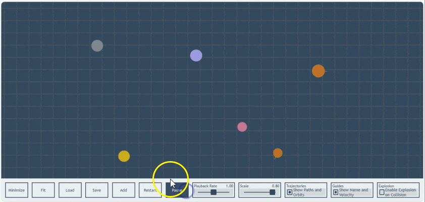

# Galaxy Engine

  

Galaxy Engine is a two-dimensional gravity simulator based on <a href=" https://en.wikipedia.org/wiki/Newton%27s_law_of_universal_gravitation">Newton's law of universal gravitation</a>. This simulator is part of an educational web application, trying to provide a minimal interactive demonstration of how gravity works in large scales. The simulator is written in JavaScript and is compatible with all the modern browsers. However, Galaxy Engine is not just a humble simulator! It is a complete web application. In the following I explain it in more detail.
# Structure
## Backend
The backend script, [galaxy.js](galaxy.js), contains 3 main components; the ` Projectile` class is responsible for any physical object inside the simulator; the `galaxy` object controls the simulator’s behavior; and the `physics` function is where the magic happens! The coding is descriptive and different blocks are labeled properly.
## Front-End
The front-end script, [main.js](main.js), 

